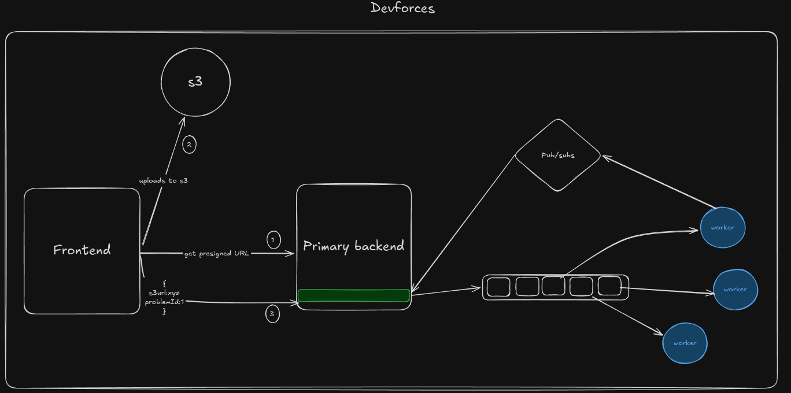

# DevForces

A competitive coding platform where developers build backend systems and battle-test them against hidden test suites — all inside isolated Docker containers.

Built for large-scale online cohorts, DevForces lets admins create contests, and participants submit code that gets executed and evaluated in real-time with live-streamed logs and Codeforces-style leaderboards.

## Architecture

